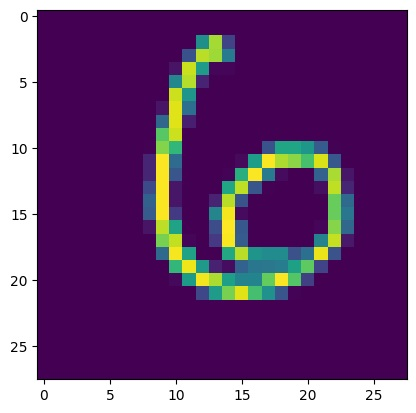

## Pytorch Notebook on MNIST Dataset
### Objective of this Notebook : 
Main objective of this notebook is to use pytorch and predict the number from the MNIST dataset image. 

### MNIST Information
*   A collection of grayscale images of handwritten digits (0-9).
*   Each image is 28 pixels wide and 28 pixels high (28x28).
*   There are 60,000 training images and 10,000 test images.
*   Each image is labeled with the corresponding digit (0-9).

### Step 1 : Import All the necessary Library 
```bash
    import torch
    import torch.nn as nn
    import torch.nn.functional as F
    from torch.utils.data import DataLoader
    from torchvision import datasets, transforms
    from torchvision.utils import make_grid


    import numpy as np
    import pandas as pd
    from sklearn.metrics import confusion_matrix
    import matplotlib.pyplot as plt
    %matplotlib inline
```

### Step 2 : Create transform
- Convert MNIST Image Files into a Tensor of 4-Dimensions ((batch size of images, Height, Width, Color Channel))
- We will use later to convert the image into tensor
* **4 Dimensions** : Batch Size, Height, Width, Color Channel
```bash
    transform = transforms.ToTensor()
```

### Step 3 : Get the Train and Test Data 
```bash
    # Train  Data  --> If the train data is not there it will donwload the data
    train_Data = datasets.MNIST(root=r'MNIST', train=True, download=True, transform=transform)

    # Test  Data   --> If the test data is not there it will download the data
    test_Data = datasets.MNIST(root=r'MNIST', train=False, download=True, transform=transform)
```

### Step 4 : Load Training Data and Testing data in batches
```bash
    # Create a small batch size for images.... let's say 10  --> 60,000 image will be divide into 10 batches where each batch will have 6000 images
    # With this method will load load the images in the set of 10 --> 10,000 image will be divide into 10 batches where each batch will have 1000 images

    train_loader = DataLoader(train_Data, batch_size=10, shuffle=False)
    test_loader = DataLoader(test_Data, batch_size=10, shuffle=False)
```

### Step 5 : Create Convolution Neural Neteork Model Class as per our need
In our model we will use 2 convolution layer 
Note : Output of 1 convolution layer will be input of second convolution layer

```bash
#Model Class
class ConvolutionalNetwork(nn.Module):
    def __init__(self):
        super().__init__()
        self.conv1 = nn.Conv2d(1, 6, 3, 1)     # Convoution Layer 1
        self.conv2 = nn.Conv2d(6, 16, 3, 1)    # Convolution Layer 2

        # Fully Connected layer
        self.fc1 = nn.Linear(5*5*16, 120)      # Fully Connected Layer 1 
        self.fc2 = nn.Linear(120, 84)          # Fully Connected Layer 2 
        self.fc3 = nn.Linear(84, 10)           # Fully Connected Layer 3 

    def forward(self,X):
        #First Pass
        X = F.relu(self.conv1(X))
        X = F.max_pool2d(X, 2, 2)               # 2x2 kernal and strikde 2

        #Second Pass
        X = F.relu(self.conv2(X))
        X = F.max_pool2d(X, 2, 2)              # 2x2 kernal and strikde 2

        #Re-view to flatenn i out 
        X = X.view(-1, 16*5*5)                 

        # Fully Connected layers
        X = F.relu(self.fc1(X))
        X = F.relu(self.fc2(X))
        X = self.fc3(X)
        return F.log_softmax(X, dim=1)         # Return a single dimensional array 
```

### Step 6 : Feed the Manual Seet and Create a instance of our Convoution class

```bash
    # Create an instance of our model
    torch.manual_seed(41)
    model = ConvolutionalNetwork()
```
### Step 7 : Define the Loss Function and Optimizer
```bash
    # Loss Function  and Optimizer
    criterion = nn.CrossEntropyLoss()
    optimizer = torch.optim.Adam(model.parameters(), lr = 0.02) 
```
### Step 8 : Training
```bash
    import time
    start_time = time.time()

    epochs = 5
    train_losses = []
    test_losses = []
    train_correct = []
    test_correct = []


    # For loops of epochs
    for i in range(epochs):
        trn_corr = 0
        test_corr = 0
        batch_corr = 0

        #Train 
        for b, (X_train, y_train) in enumerate(train_loader):
            b+=1 
            y_pred = model(X_train) 
            loss = criterion(y_pred, y_train)
            prdicted = torch.max(y_pred, 1)[1] 
            bach_corr = (prdicted == y_train).sum()
            trn_corr += batch_corr 
        
            optimizer.zero_grad()
            loss.backward()
            optimizer.step()

            if b%600 == 0:
                print(f"Epcoh {i} Batch {b},  Loss : {loss.item()}")
        

        train_losses.append(loss)
        train_correct.append(trn_corr)

        #Test , Remove teh gradient because we do not need to update teh weights and biases 
        with torch.no_grad(): 
            for b, (X_test, y_test) in enumerate(test_loader):
                y_val = model(X_test)
                predicted = torch.max(y_val.data, 1)[1] 
                test_corr += (predicted == y_test).sum() 
                loss = criterion(y_val, y_test)

            test_losses.append(loss)
            test_correct.append(test_corr)

    current_time = time.time()
    total = current_time-start_time
    print(f"Training took : {total/60} minutes")
```

### Optional : the number of capture training losses and test losses
```bash
    print(f"Train losses: {len(train_losses)}, Test losses: {len(test_losses)}")
    train_losses, test_losses
```
### Optional : Draw the Training and Validation loss
```bash
    train_losses = [tl.item() for tl in train_losses]
    test_losses = [tl.item() for tl in test_losses]

    # Graph the loss at epoch
    plt.plot(train_losses, label="Training Loss")
    plt.plot(test_losses, label="Validation Loss")
    plt.title("Loss at Epoch")
    plt.legend()
```
   

### Optional : Draw the Training and Validation Accuracy 
```bash  
    # Graph the accuracy at the end of the each epoch
    plt.plot([t/600 for t in train_correct], label="Traning Accuracy")
    plt.plot([t/100 for t in test_correct], label ="Validation Accuracy")
    plt.title("Accuracy at the end of each Epoch")
    plt.legend()
```


### Optional : Check the how many correct result we get when we apply our CNN Model test data
```bash 
    ## Load the test data 
    test_load_everthing = DataLoader(test_Data, batch_size=100, shuffle=False)
    with torch.no_grad():
        correct = 0
        for X_test, y_test in test_load_everthing:
            y_val = model(X_test)
            predicted = torch.max(y_val, 1)[1]
            correct += (predicted == y_test).sum()

    correct.item()
```
### Optional : Test our model with data and check manually by code only 
```bash
# Grab an image which is at index 100 in test_Data
    # This image will contain label but to test our model we do not need label so will modify
test_Data[100] 


# This way we will get tensor  without label
test_Data[100][0]


#Reshape it into 28 by 28 pixel size
test_Data[100][0].reshape(28, 28)

# Reshape the iamge and visualize 
    # If we visualize we no need to old step because to check the image we already reshape insideplt.imshow()
plt.imshow(test_Data[100][0].reshape(28, 28))
```



### Prediction
```bash
# As we already see at test_Data[100] have label 6 now we will predict with our trained model.
model.eval()
with torch.no_grad():
	new_prediction = model(test_Data[100][0].view(1, 1, 28, 28)) 

## This will give the bigged tensor amound the data
new_prediction.argmax()
```

    