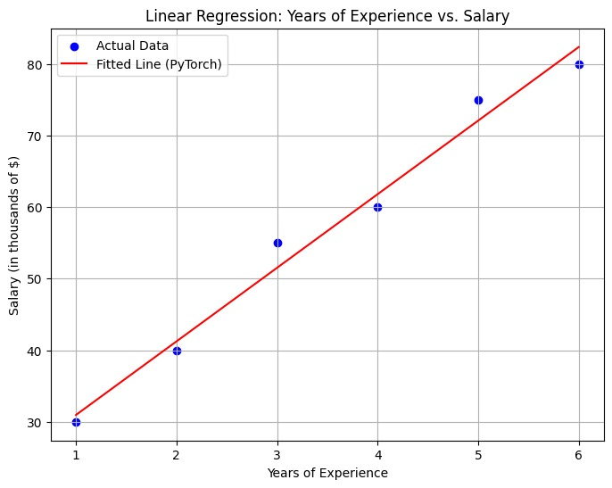

## Simple Linear Regresion

### Our object to draw the best fit line using pytorch linearRegressionModel

This is step by step guide to use the linear regression model and get the weight and bias which we can use to pridict the result.

## We will draw BEST FIT LINE

## Requried Libaries 

```bash
# Libararies we need to implement the linear regrestion model 

import numpy as np              # To deal with Array
import torch                    # pytoch import 
import torch.nn as nn           # Everything is come from nn 
import matplotlib.pyplot as plt # Imagine the plot

```
## Dataset for Linear Regression

#### A very simple and classic one is a dataset relating Years of Experience to Salary
| Years of Experience | Salary | 
|:---------------|:-----------|
| 1 | 30 |
| 2 | 40 |
| 3 | 55 |
| 4 | 60 |
| 5 | 75 |
| 6 | 800 |

We will use linear regression on this data so we can guess the salary if we we know expereince and vice versa. with the help of linear regression we can draw best fit line as you will see in this notebook.

#### <u>Export to Sheets</u>
* Line equation in mathematics is like **y = m * x + c**
We have to take the above data in the form of array which we can use in programming using numpy.
    ```bash
    #import the above data set for programm
    X_numpy =  np.array([1, 2, 3, 4, 5, 6], dtype=np.float32)
    y_numpy = np.array([30, 40, 55, 60, 75, 80], dtype=np.float32)
    ```
### Step 1 : Prepare the data as per Pytorch requirement
- **Convert NumPy arrays to PyTorch tensors** Because Pytorch works with Tensor only --> **torch.from_numpy(<Your Numpy Array>)**
- We also need to **reshape X_numpy to be a 2D array (or a column vector) --> using .reshape(-1,1 )**
    ```bash
    X = torch.from_numpy(X_numpy.reshape(-1, 1))
    y = torch.from_numpy(y_numpy.reshape(-1, 1))
    ```
-  **Key Learning**
    * PyTorch models expect inputs in this shape (batch_size, num_features).
    * batch_size is the number of samples, and num_features is 1 (Years of Experience).


### Step 2. Define the Model
* Our linear regression model is very simple: it has one linear layer.
* Input and Output layer WE can programm this
* **y = m*x + c**  is a linear transformation.

    ```bash
    class LinearRegressionModel(nn.Module):
        def __init__(self, input_dim, output_dim):
            super(LinearRegressionModel, self).__init__()
            self.linear = nn.Linear(input_dim, output_dim)

        def forward(self, x):
            out = self.linear(x)

            return out
    ```
###  Instantiate the model
* input_dim = 1 (we have one feature: Years of Experience)
* output_dim = 1 (we want to predict one value: Salary)
    ```bash
    input_dim = 1
    output_dim = 1
    model = LinearRegressionModel(input_dim, output_dim)
    ```

### Step 3. Define Loss Function and Optimizer
* **Loss Function:** This measures how bad our model's predictions are compared to the actual values.
    * For regression, Mean Squared Error (MSE) is common. It calculates the average of the squared differences between predicted and actual values
    * Squaring ensures errors are positive and penalizes larger errors more.

    ```bash
    criterion = nn.MSELoss()
    ```

* **Optimizer:** This is the algorithm that adjusts the model's parameters (m and c) to minimize the loss.
    * **Stochastic Gradient Descent (SGD)** is a popular choice.
    * **'model.parameters()'** tells the optimizer which values it needs to adjust.
    * **'lr'** is the learning rate: it controls how big the adjustment steps are.
    * A small learning rate means slower but potentially more precise learning.
    * A large learning rate might overshoot the optimal values.

    ```bash
    learning_rate = 0.01
    optimizer = torch.optim.SGD(model.parameters(), lr=learning_rate)
    ```
### Step 4: Training the Model
* Training involves feeding the data to the model multiple times **epochs and updating the weights (m and c)** in each iteration to reduce the loss.
* **num_epoch** is How many times we go through the entire dataset

   ```bash
    num_epochs = 2000

    for epoch in range(num_epochs):

        outputs = model(X)                     # Pass Values to Model and Get output

        loss = criterion(outputs, y)           # Loss Function check the difference between actual and predicted.

        optimizer.zero_grad()                  # Clears old gradients from the previous step.It's important because
                                            # otherwise gradients would accumulate.

        loss.backward()                        # Computes the gradients of the loss with respect to model parameters (m and c).
                                            # This tells us how much each parameter contributed to the error and in which
                                            # direction to adjust it.

        optimizer.step()                       # optimizer.step(): Updates the model parameters (m and c) using the
                                            # computed gradients and the learning rate. It tries to move the
                                            # parameters in the direction that reduces the loss.

        if (epoch + 1) % 200 == 0:
            print(f'Epoch [{epoch+1}/{num_epochs}], Loss: {loss.item():.4f}')
    ```
### Step 5. Evaluating the Model and Plotting
* After training, our model has learned (hopefully good) values for 'm' and 'c'.
* Put the model in evaluation mode (this is good practice, though for a simple linear model

    ```bash
    model.eval()
    LinearRegressionModel(
    (linear): Linear(in_features=1, out_features=1, bias=True)
    )
    ```
### Step 6.  Get predictions on the training data (or ideally, on new unseen data)
* We use **torch.no_grad()** because we are just making predictions, not training, so we don't need PyTorch to calculate gradients. This saves memory and computation.

* **Note :** During training we need to track the gradient

    ```bash
    with torch.no_grad():
        predicted = model(X).detach().numpy()   # .detach() removes it from computation graph, .numpy() converts to NumPy array
    ```
### Step 7. Inspecting the Learned Parameters
* The linear layer (self.linear) in our model stores the learned 'm' (weight) and 'c' (bias).
    ```bash
    learned_m = model.linear.weight.item()
    learned_c = model.linear.bias.item()

    print(f"\nPyTorch Learned Parameters:")
    print(f"Slope (m): {learned_m:.4f}")
    print(f"Y-intercept (c): {learned_c:.4f}")
    numpy() converts to NumPy array
    ```

* ### Optional : Plotting
    ```bash
    plt.figure(figsize=(8, 6))
    plt.scatter(X_numpy, y_numpy, color='blue', label='Actual Data')
    plt.plot(X_numpy, predicted, color='red', label='Fitted Line (PyTorch)')
    plt.title('Linear Regression: Years of Experience vs. Salary')
    plt.xlabel('Years of Experience')
    plt.ylabel('Salary (in thousands of $)')
    plt.legend()
    plt.grid(True)
    plt.show()
    ```


* ## Manual Varification for above steps:
* Since we have slope(m) and intercept(c) we can minimum loss prediction with linear structure data. Like we have to calculate the guy with zero experience who much salary he/she can expect.

    ```bash
    y = m * x + c => 10.2884 * 0 + 20.6551 => 20.6551
    ```
* With the above equation we can guess how mush salary fresher can expect 20.667. This is not in true world but this is best example I can find the explain the simple linear regression.
---
* ### PyTorch Learned Parameters:
* **Slope (m):** 10.2884
* **Y-intercept (c):** 20.6551


* ### Let's quickly check our manual calculation with this full dataset
    ```bash
    n = 6
    sum_x = np.sum(X_numpy)  # 1+2+3+4+5+6 = 21
    sum_y = np.sum(y_numpy)  # 30+40+55+60+75+80 = 340
    sum_xy = np.sum(X_numpy * y_numpy) # 30*1 + 40*2 + 55*3 + 60*4 + 75*5 + 80*6 = 30+80+165+240+375+480 = 1370
    sum_x_sq = np.sum(X_numpy**2) # 1+4+9+16+25+36 = 91

    m_manual = (6 * 1370 - 21 * 340) / (6 * 91 - 21**2)
    m_manual = (8220 - 7140) / (546 - 441)
    m_manual = 1080 / 105
    m_manual = 10.2857

    c_manual = (340 - m_manual * 21) / 6
    c_manual = (340 - 10.2857 * 21) / 6
    c_manual = (340 - 216.0) / 6
    c_manual = 124 / 6
    c_manual = 20.6667
    print(f"Manual calculation with full dataset: m = {m_manual:.4f}, c = {c_manual:.4f}")
    ```
* Our PyTorch model should get close to these values.

* **Plotting**
    ```bash
    m_manual_full = 10.2857
    c_manual_full = 20.6667
    y_manual_line = m_manual_full * X_numpy + c_manual_full
    plt.plot(X_numpy, y_manual_line, color='green', linestyle='--', label=f'Manual Fit (m={m_manual_full:.2f}, c={c_manual_full:.2f})')

    plt.legend()
    plt.grid(True)
    plt.show()
    ```
---
### Author : shergillkuldeep@outlook.com
**Note :** Feel free to contact if you have any suggestion