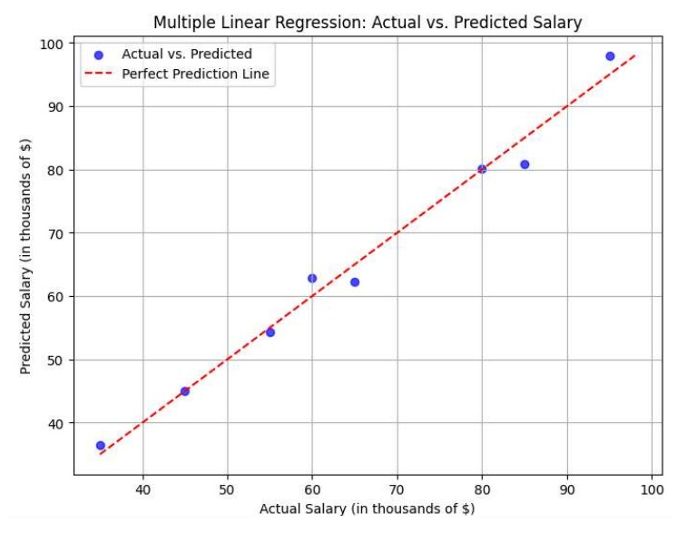
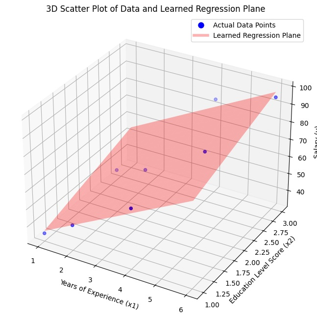

# Introduction 
In this work book we will learn how to apply linear regression if we have more than 1 features.

## Necessary Import
```bash
    import torch
    import torch.nn as nn
    import numpy as np
    import matplotlib.pyplot as plt
```

### 1. Data Preparation
- X1 = Years of Experience
- X2 = Education Level Score
- y = Salary (in thousands of $)
```bash
X_numpy = np.array([
    [1, 1],
    [2, 1],
    [3, 2],
    [4, 1],
    [5, 2],
    [6, 3],
    [2, 2],
    [4, 3]], dtype=np.float32)

y_numpy = np.array([35, 45, 60, 65, 80, 95, 55, 85], dtype=np.float32)
```

### Convert NumPy arrays to PyTorch tensors
- X will now have 2 columns (features)
```bash
    X = torch.from_numpy(X_numpy)
    y = torch.from_numpy(y_numpy.reshape(-1, 1))
```


### 2. Define the Model
- Our linear regression model is very simple: it has one linear layer.
-  Input and Output layer WE can programm this
-  **y = m1*x1 + m2*x2 + c**  is a linear transformation.

```bash
    class LinearRegressionModel(nn.Module):
        def __init__(self, input_dim, output_dim):
            super(LinearRegressionModel, self).__init__()
            self.linear = nn.Linear(input_dim, output_dim)

        def forward(self, x):
            out = self.linear(x)
            return out
        y = torch.from_numpy(y_numpy.reshape(-1, 1))
```
### Instantiate the model
-  input_dim is now the number of features in X_numpy, which is X_numpy.shape[1]
-  output_dim = 1 (we want to predict one value: Salary)

```bash
    input_dim = X_numpy.shape[1]
    output_dim = 1
    model = LinearRegressionModel(input_dim, output_dim)
```
### 3. Define Loss Function and Optimizer
- **Loss Function:** This measures how bad our model's predictions are compared to the actual values.
-  For regression, **Mean Squared Error (MSE) is common**. It calculates the average of the squared differences between predicted and actual values. Squaring ensures errors are positive and penalizes larger errors more.
```bash
criterion = nn.MSELoss()
```
- **Optimizer:** This is the algorithm that adjusts the model's parameters (m and c) to minimize the loss.
    -  **Stochastic Gradient Descent (SGD)** is a popular choice.
    -  **'model.parameters()'** tells the optimizer which values it needs to adjust.
    -  **'lr'** is the learning rate: it controls how big the adjustment steps are.
        - A small learning rate means slower but potentially more precise learning.
        - A large learning rate might overshoot the optimal values.

```bash
    # You might need to tune this for different datasets/models
    learning_rate = 0.01 
    optimizer = torch.optim.SGD(model.parameters(), lr=learning_rate)
```
### 4. Training the Model
Training involves feeding the data to the model multiple times (epochs) and updating the weights (m and c) in each iteration to reduce the loss. **num_epoch** is How many times we go through the entire dataset
```bash
num_epochs = 3000 

for epoch in range(num_epochs):
    # Forward pass
    outputs = model(X)

    # Calculate loss
    loss = criterion(outputs, y)

    # Backward pass and optimization
    optimizer.zero_grad()
    loss.backward()
    optimizer.step()

    if (epoch + 1) % 300 == 0:
        print(f'Epoch [{epoch+1}/{num_epochs}], Loss: {loss.item():.4f}')
```

### 5. Evaluating the Model and Plotting
After training, our model has learned (hopefully good) values for 'm' and 'c'. Put the model in evaluation mode (this is good practice, though for a simple linear model
```bash
    model.eval()
    with torch.no_grad():
        predicted = model(X).detach().numpy()
```
### 2D Plotting ( Optional )
Plotting for multiple linear regression is a bit different. We can't easily plot a line on a 2D graph with 2 input features directly against y.
A common practice is to plot actual vs. predicted values. If they fall close to a diagonal line, it indicates good predictions.
```bash
    plt.figure(figsize=(8, 6))
    plt.scatter(y_numpy, predicted, color='blue', alpha=0.7, label='Actual vs. Predicted')
    # Add a diagonal line for reference (perfect prediction line y=x)
    min_val = min(np.min(y_numpy), np.min(predicted))
    max_val = max(np.max(y_numpy), np.max(predicted))
    plt.plot([min_val, max_val], [min_val, max_val], 'r--', label='Perfect Prediction Line')
    plt.title('Multiple Linear Regression: Actual vs. Predicted Salary')
    plt.xlabel('Actual Salary (in thousands of $)')
    plt.ylabel('Predicted Salary (in thousands of $)')
    plt.legend()
    plt.grid(True)
    plt.show()
```


### 3D Plotting ( Optional )
For 2 input features, we can also try a 3D scatter plot of the data and potentially the plane (though plotting the plane is more complex). Here's how you might plot the original data in 3D:
```bash
    fig = plt.figure(figsize=(10, 8))
    ax = fig.add_subplot(111, projection='3d')
    ax.scatter(X_numpy[:, 0], X_numpy[:, 1], y_numpy, color='blue', label='Actual Data Points')
    # To plot the learned plane:
    # Create a meshgrid for X1 and X2
    x1_surf, x2_surf = np.meshgrid(np.linspace(X_numpy[:, 0].min(), X_numpy[:, 0].max(), 20),
                                np.linspace(X_numpy[:, 1].min(), X_numpy[:, 1].max(), 20))
    # Use the model to predict Z values for the meshgrid
    x_surf_flat = np.c_[x1_surf.ravel(), x2_surf.ravel()]
    z_surf = model(torch.from_numpy(x_surf_flat).float()).detach().numpy().reshape(x1_surf.shape)
    ax.plot_surface(x1_surf, x2_surf, z_surf, color='red', alpha=0.3, label='Learned Regression Plane')

    # Adding a phantom artist for the legend of the surface plot
    from matplotlib.lines import Line2D
    legend_elements = [Line2D([0], [0], marker='o', color='w', label='Actual Data Points',
                            markerfacecolor='blue', markersize=10),
                    Line2D([0], [0], color='red', lw=4, label='Learned Regression Plane', alpha=0.3)]


    ax.set_xlabel('Years of Experience (x1)')
    ax.set_ylabel('Education Level Score (x2)')
    ax.set_zlabel('Salary (y)')
    ax.set_title('3D Scatter Plot of Data and Learned Regression Plane')
    ax.legend(handles=legend_elements)
    plt.show()

```

### 6. Inspecting the Learned Parameters
 - **model.linear.weight** will now contain two weights (m1, m2)
 - **model.linear.bias** will still contain one bias (c)
 - **learned_weights = model.linear.weight.data.numpy().flatten()** # Use .data to get tensor data
```bash  
    learned_bias = model.linear.bias.data.numpy()[0]

    print(f"\nPyTorch Learned Parameters:")
    print(f"Weights (m1, m2, ...): {learned_weights}")
    for i, weight in enumerate(learned_weights):
        print(f"  Weight for feature x{i+1} (m{i+1}): {weight:.4f}")
    print(f"Y-intercept (c): {learned_bias:.4f}")

    print(f"\nEquation of the line from PyTorch:")
    equation_parts = [f"{learned_weights[i]:.2f} * x{i+1}" for i in range(len(learned_weights))]
    print(f"Salary = {' + '.join(equation_parts)} + {learned_bias:.2f}")
```
---
### Author : shergillkuldeep@outlook.com
**Note :** Feel free to contact if you have any suggestion