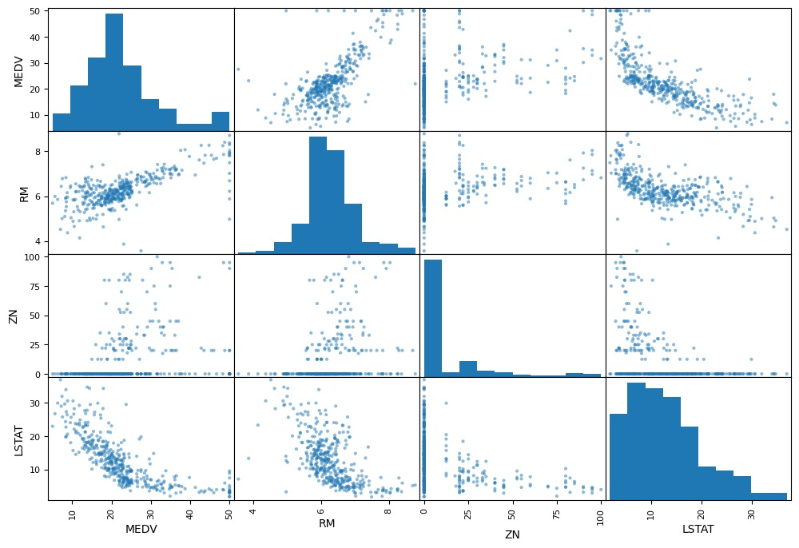
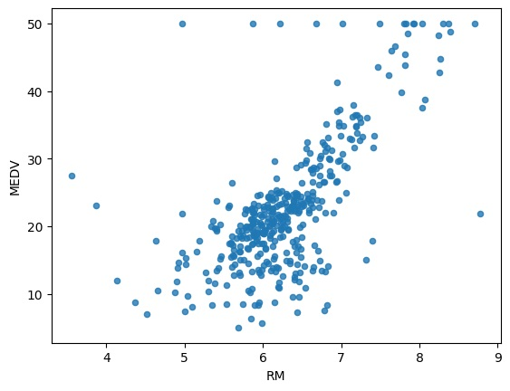

## Real Estate - Price Predictor

### INTRODUCTION
In this small project we will see how we can apply Machine Learning Algorithem to predict the Real Estate Price. 

### About Dataset
- I will use "**Boston Housing Dataset**," a classic dataset used in machine learning for regression. It was originally created by Professor **Thomas Bishop at MIT.**  It's a well-known and widely used dataset.

- This dataset is a collection of features (independent variables) and a target variable (median house value) that are commonly used in real estate analysis.  It's a classic dataset for predicting house prices.  You could use this data for:

  - **Predictive Modeling:**  Building a model to predict house prices based on the features.
  - **Feature Importance Analysis:**  Determining which features have the biggest impact on house prices.
  - **Geographic Analysis:**  Understanding how location and neighborhood characteristics affect property values.
  - **Market Analysis:**  Analyzing trends in the real estate market.

- **Each Column Description :**
  - **CRIM (Crime Rate):**  This is almost certainly the crime rate per 1000 residents in the area.  Higher values indicate higher crime.  A key factor in property values.

  - **ZN (Zinc Ratio):** This is likely a ratio of zinc to total house value. It's a measure of the quality of the housing stock. Higher values suggest better quality homes.The term "zinc ratio" in real estate isn't a standard or widely recognized term. It's possible it refers to the ratio of zinc-related materials or components used in a property's construction or maintenance. 

  - **INDUIS (Industrial):**  This probably represents the proportion of land in the area zoned for industrial use.  Higher values mean more industrial land.  Can impact property values (positively or negatively, depending on the type of industry).

  - **CHAS (Charles):** This is a bit less obvious without more context, but it's often related to the presence of Charles River or other water features. It could indicate proximity to a river, lake, or other body of water.  Proximity to water often increases property values.

  - **NOX (Nitrogen Oxide):**  This is likely a measure of air pollution, specifically nitrogen oxide levels.  Higher values indicate more pollution.  Air quality is a factor in desirability and property values.

  - **RM (Room Size):**  This is the average size of the rooms in the houses in the area.  It's a measure of the size of the homes.  Larger rooms generally correlate with higher property values.

  - **AGE (Age):**  This is the average age of the housing stock in the area.  Older homes might have more character but could also require more maintenance.  A mix of ages is often desirable.

  - **DIS (Distance):**  This is the distance from the house to amenities, like stores, schools, or major employment centers.  Shorter distances are generally more desirable.

  - **RAD (Radon):**  This represents the average radon level in the area. Radon is a radioactive gas that can be harmful to health.  Higher values indicate a greater risk.

  - **TAX (Tax):**  This is the property tax rate.  Higher taxes can make an area less attractive to buyers.

  - **PTRATIO (Pupil-Teacher Ratio):**  This is the ratio of students to teachers in the local schools.  Lower ratios are generally considered better, indicating smaller class sizes and potentially better education.

  - **B (Brokers):** This is the number of real estate brokers in the area per 1000 residents.  Higher values might indicate a more active real estate market.

  - **LSTAT (Loan Amount):** This is the average loan amount used to purchase homes in the area.  It reflects the affordability of housing.

  - **MEDV (Median Value):** This is the median (middle) sale price of houses in the area.  This is the primary target variable in many real estate datasets.  It's a key indicator of property values.


Step 1 : Load the dataset
- Understand Your Dataset
- Read the data and check column infomraiton.
- For example
    ```bash
        import pandas as pd
        housing = pd.read_csv("Boston Housing Dataset.csv")
        # Get the top 5 values from top 
        housing.head()
        # Get datatype for the each column
        housing.info()
        # Get more information like mean cout std min max etc.
        housing.describe()
    ```
Step 2 : Divide the dataset into train and test
- Use sklearn train_test_split to divide the data into train and test data
    ```bash
        from sklearn.model_selection import train_test_split
        train_set, test_set  = train_test_split(housing, test_size=0.2, random_state=42)
        print(f"Rows in train set: {len(train_set)}\nRows in test set: {len(test_set)}\n")
    ```

Step 3 : Shuffle the data
It should be done because sometime data is concentrated in specfic area of dataset which can be impact. When we will split the data. There is possiblity the data can be either be go only in train or test dataset. 
- code
    ```bash
        from sklearn.model_selection import StratifiedShuffleSplit
        split = StratifiedShuffleSplit(n_splits=1, test_size=0.2, random_state=42)
        for train_index, test_index in split.split(housing, housing['CHAS']):
            strat_train_set = housing.loc[train_index]
            strat_test_set = housing.loc[test_index]
    ```
Step 3 : Check for Correlations 
This give the correlation between the different columns 
* Correlation in mathmatical form
    ```bash
        corr_matrix = housing.corr()
        corr_matrix['MEDV'].sort_values(ascending=False)
    ```
* Correlation in charts
    ```bash
        from pandas.plotting import scatter_matrix
        attributes = ["MEDV", "RM", "ZN", "LSTAT"]
        scatter_matrix(housing[attributes], figsize = (12,8))
    ```
    
* Correlation between specific columns only 
    ```bash
        housing.plot(kind="scatter", x="RM", y="MEDV", alpha=0.8)
    ```
    

## Optional ( Generate Needed columns )
Trying out Attribute combinations, Sometimes we have to generate the columns from the existing dataset so we can use those columns to check correction.
```bash
    housing["TAXRM"] = housing['TAX']/housing['RM']
    housing.head()
```

## Divide the data into features and labels
- **housing** will have all the features
- **housing_labels** will contain all the label relate the to price as per provied information

```bash
    housing = strat_train_set.drop("MEDV", axis=1)
    housing_labels = strat_train_set["MEDV"].copy()
```


## Step 4 : Fix Missing Attributes --> I fix this inside pipeline
## Step 5 : Fix Scaling issue --> I fix this issue inside pipline
## Pipeline


```bash
    from sklearn.pipeline import Pipeline
    from sklearn.preprocessing import StandardScaler
my_pipeline = Pipeline([
    ('imputer', SimpleImputer(strategy="median")),    # Fix missing Attributes
    #     ..... add as many as you want in your pipeline
    ('std_scaler', StandardScaler()), # Fix Scaling Issue
])
housing_num_tr = my_pipeline.fit_transform(housing)
```
---
Data Clearning Done
---
## Step 6 : Apply the ML model 
Here will will select a desired model for Real Estate agency.

```bash
    from sklearn.linear_model import LinearRegression
from sklearn.tree import DecisionTreeRegressor
from sklearn.ensemble import RandomForestRegressor
# model = LinearRegression()
# model = DecisionTreeRegressor()
model = RandomForestRegressor()
model.fit(housing_num_tr, housing_labels)
```

## Step 7 : Evaluating the model
After using different model we can check error using evalution in this i am going to use the mean squared error 

```bash
from sklearn.metrics import mean_squared_error
import numpy as np

housing_predictions = model.predict(housing_num_tr)
mse = mean_squared_error(housing_labels, housing_predictions)
rmse = np.sqrt(mse)  
```

## Step 8 : Saving the model

```bash
    from joblib import dump, load
    dump(model, 'realestate.joblib') 
```

## Step 9 : Testing the model on test data


```bash
    X_test = strat_test_set.drop("MEDV", axis=1)
    Y_test = strat_test_set["MEDV"].copy()
    X_test_prepared = my_pipeline.transform(X_test)
    final_predictions = model.predict(X_test_prepared)
    final_mse = mean_squared_error(Y_test, final_predictions)
    final_rmse = np.sqrt(final_mse)
    print(final_predictions, list(Y_test))
```

## Step 10 : Load the save model and use 

```bash
    from joblib import dump, load
    import numpy as np
    model = load('realestate.joblib') 
    features = np.array([[-5.43942006, 4.12628155, -1.6165014, -0.67288841, -1.42262747,
        -11.44443979304, -49.31238772,  7.61111401, -26.0016879 , -0.5778192 ,
        -0.97491834,  0.41164221, -66.86091034]])
    model.predict(features)
```