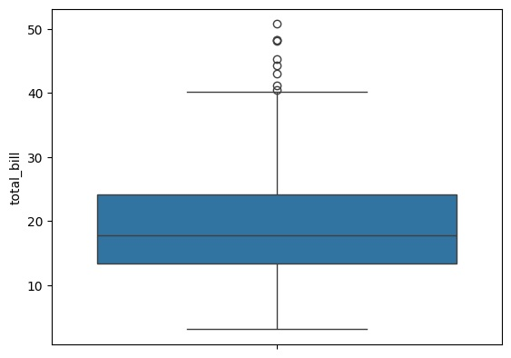
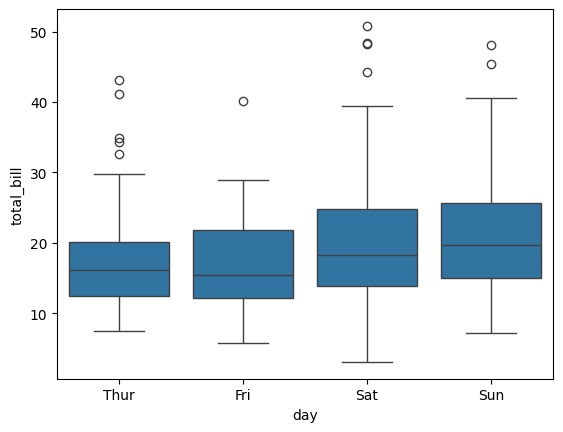
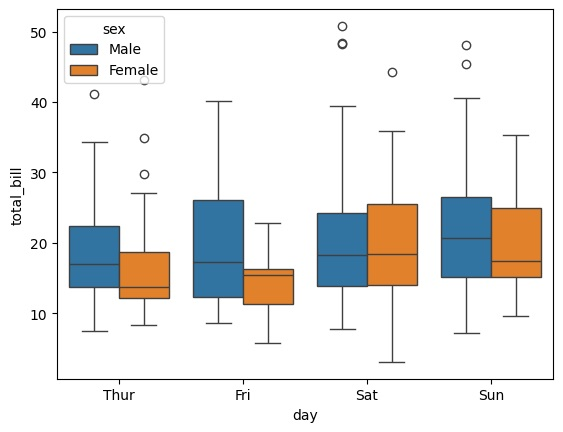
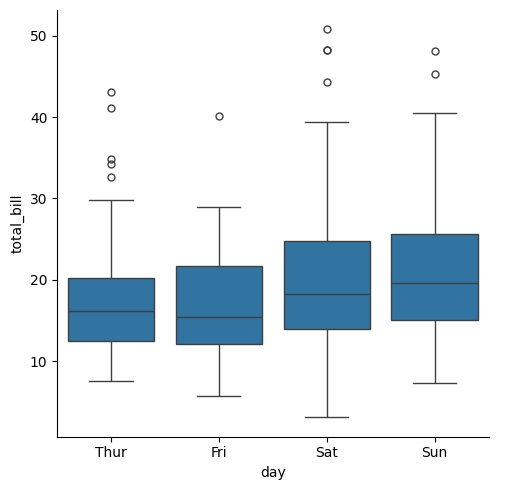
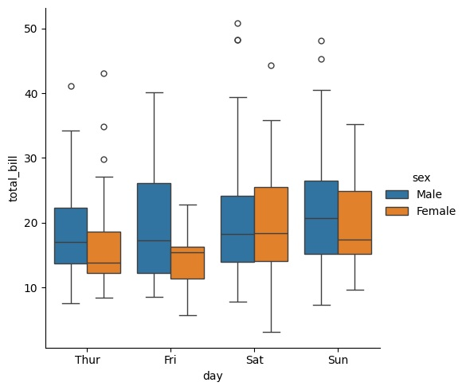

# Box Plot Using Seaborn

### Objective :
Draw the BOX plot on tips dataset using seaborn library.

### Load the DATA
```bash
import seaborn as sns
tips = sns.load_dataset('tips')
```
### About Dataset :
The "tips" dataset is a popular collection of restaurant customer data, recorded by one waiter over several months, that contains attributes like total bill, tip amount, customer's gender, smoker status, day and time of the meal, and the size of the dining party. 
#### Key Features of the "tips" Dataset
- **Total Bill:** The total cost of the meal, including any taxes. 
- **Tip:** The amount of tip left by the customer. 
- **Sex:** The gender of the bill payer, typically recorded as Male or Female. 
- **Smoker:** A binary indicator (Yes/No) for whether a customer in the party is a smoker. 
- **Day:** The day of the week the meal was consumed. 
- **Time:** The time of day, usually categorized as Lunch or Dinner. 
- **Size:** The number of people in the dining party. 

### Draw Box plot 
- **1. Direct Way**
    - sns.boxplot(data=Your_Data, y='Desired Column for Box plot')
    - sns.boxplot(data=Your_Data, x='Column For x axis', y='column for y axis')
    - sns.boxplot(data=Your_Data, x='Column For x axis', y="column for y axis", hue='type')

    ```bash
    sns.boxplot(data=tips, y='total_bill')
    ```
    

    ```bash
    sns.boxplot(data=tips, x='day', y='total_bill')
    ```
    

    ```bash
    sns.boxplot(data=tips, x='day', y="total_bill", hue='sex')
    ```
    

- **1. Indirect Way { Categorial Plot }**
    - sns.catplot(data=Your_Data, x='Column For x axis', y='column for y axis', kind='box')
    - sns.catplot(data=Your_Data, x='Column For x axis', y='column for y axis', kind='box', hue='type')

    ```bash
    sns.catplot(data=tips, x='day', y='total_bill', kind='box')
    ```
    
    ```bash
    sns.catplot(data=tips, x='day', y='total_bill', kind='box', hue='sex')
    ```
    